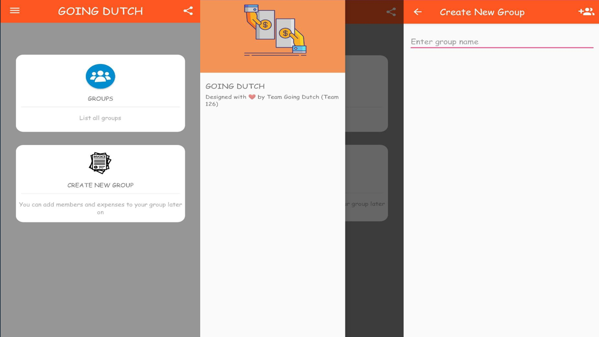

## Fit-O-Cracy
Fitness site have been developed and integrated with Open AI to help user know how fit they are and suggests workout according to their body type and requirement. Using the input provided by the user it calculates BMI and suggests custom diet plan and custom workout that suits their body.It uses MongoDB,Nodejs,Vitejs,Open API
- 
- Tags: Category 1
- Badges:
  <!-- - Badge [blue] -->
- Buttons:
  - Link [https://github.com/vishvas01/fit-o-cracy-final]

## Technical Forum page 
Features questions and answers on a wide range of topics in computer programming. Used Redux for state management and Redux Thunk. Axios for sending HTTP request to the backend. Nodejs, Expressjs for backend.Json web tokens for authentication. Netify for deploying the front-end and Heroku for back-end.
- 
- Tags: Category 2
- Badges:
  <!-- - Badge [blue] -->
- Buttons:
  - Link [https://github.com/vishvas01/Forum-page]

## Going Dutch
A split bill application will be developed to allow users to easily split bills and tasks. The application will use modern technology to eliminate the need for paper-based transactions, and will provide a centralized system for tracking and managing all occasional and recurring bills. The application will be developed using Java, Spring Boot, React, and MySQL.
- 
- Tags: Category 3
- Badges:
  <!-- - Badge [blue] -->
- Buttons:
  - Link [https://github.com/vishvas01/GoingDutch]